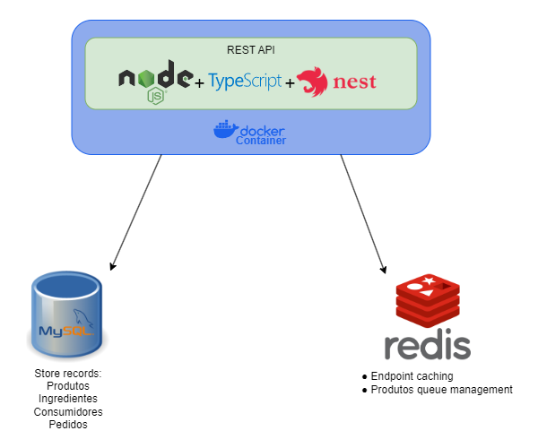

# iRango API

This project involves the development of an API for a fast food self-service system, proposed as a Tech Challenge for the Software Architecture Postgraduate Course at FIAP.

For this project, we utilized the [TypeScript](https://www.typescriptlang.org/) programming language with [Node.js](https://nodejs.org/) and the [Nest.js](https://nestjs.com/) framework. The database management includes [MySQL 5.7](https://www.mysql.com/) to handle information related to Consumidor, Produto, and Pedido. Additionally, an in-memory [Redis](https://redis.io/) database is employed for caching.

To build the API documentation, we've used [Swagger](https://swagger.io/) tool integrated with Nest.js, accessible through the endpoint: http://localhost:3000/docs

## Application Architecture and Technologies:


## Workspace Dependencies
- [Node 20.10](https://nodejs.org/)
- [Docker](https://www.docker.com/get-started/)
- Make
  - [Windows](https://gnuwin32.sourceforge.net/packages/make.htm)
  - Linux
  ```bash
  sudo apt update
  sudo apt install make
  ```

## Project Dependencies
Install project dependencies with:
```bash
npm run install
```

## Start Project using Docker
Configure all docker containers and volumes and start the application
```bash
make setup
```
or try without make
```bash
docker network create -d bridge local-network
cp .env.example .env
docker-compose build --progress=plain
docker-compose up
docker-compose exec -it service-irango-api npm run migration:run
docker-compose exec -it service-irango-api npm run seed:run
```

## Start project without Docker
Watch mode:
```bash
npm run start:dev
```

Compiled mode:
```bash
npm run build
npm run start
```

Migrations and Seeds:
```bash
npm run migration:run
npm run seed:run
```

## How to Use
We have developed a seed to populate database with some products and one Consumidor with CPF `111.111.111-11`. You can use it or create a new Consumidor.

## Endpoints
We have developed few endpoints which can be found in [consumidores.controller.ts](./src/adapter/driver/nestjs/consumidores/consumidores.controller.ts), [produtos.controller.ts](./src/adapter/driver/nestjs/produtos/produtos.controller.ts) and [pedidos.controller.ts](./src/adapter/driver/nestjs/pedidos/pedidos.controller.ts) files

## Business Requirements:
1. Cadastro do Cliente
> POST http://localhost:3000/consumidores
2. Identificação do Cliente via CPF
> GET http://localhost:3000/consumidores/cpf
3. Criar, editar e remover de produto
> POST http://localhost:3000/produtos

> PUT http://localhost:3000/produtos/:id

> DELETE http://localhost:3000/produtos/:id
4. Buscar produtos por categoria
> GET http://localhost:3000/produtos/categorias/:termo
5. Fake checkout, apenas enviar os produtos escolhidos para a fila
> POST http://localhost:3000/pedidos
6. Listar os pedidos
> GET http://localhost:3000/pedidos

## Make commands
- Setup Project: `make setup`. This command will create docker network, containers and volumes. It will also start the project and show its logs.
- Start Project: `make up`
- Stop Projects: `make down`
- Show logs: `make logs`
- Add Migration: `make migration.generate name=MigrationName`
- Run Migrations: `make migration.run`
- Add Seed: `make seed.generate name=SeedName`
- Run Seeds: `make seed.run`
- Access container bash: `make bash`
- Access Redis container: `make redis`