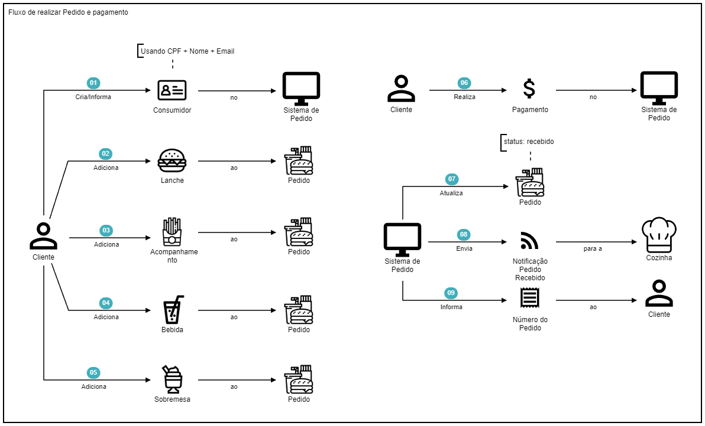
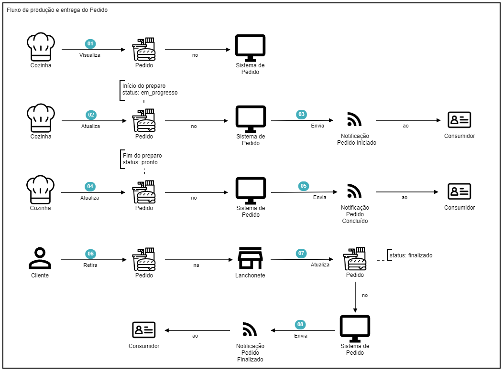
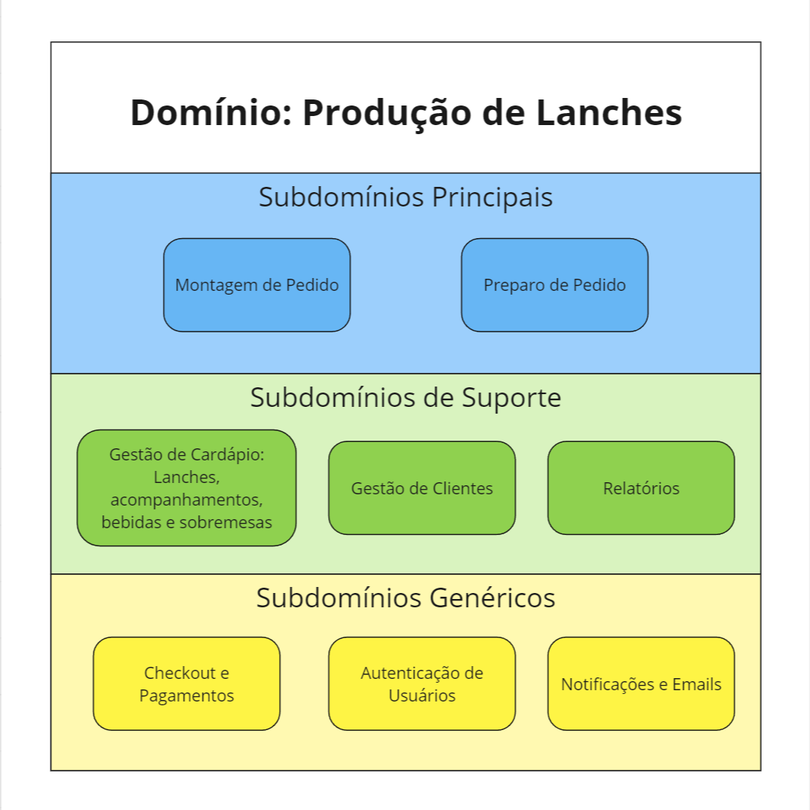
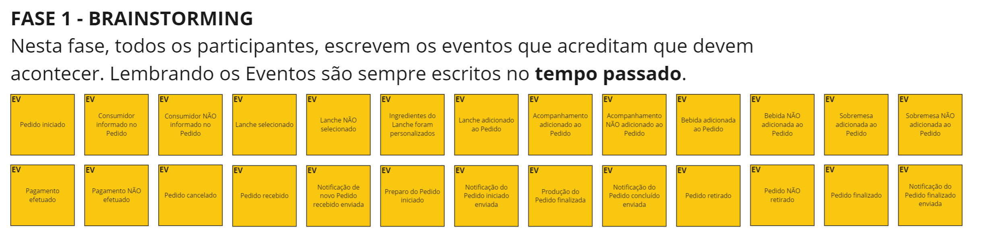
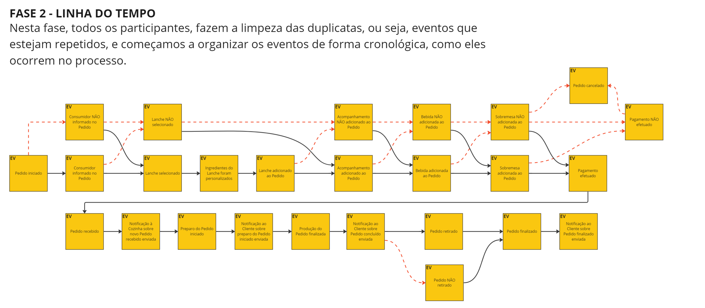
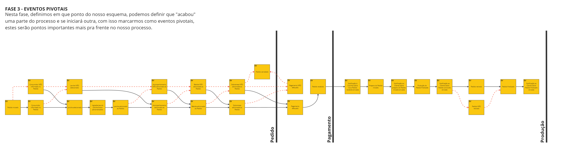
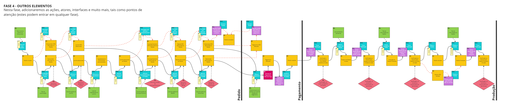
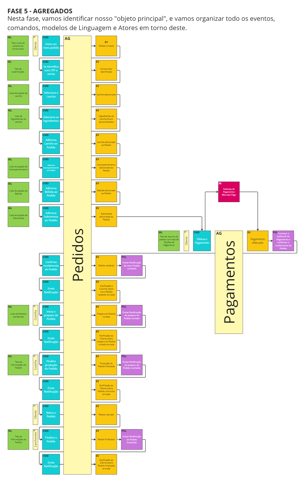
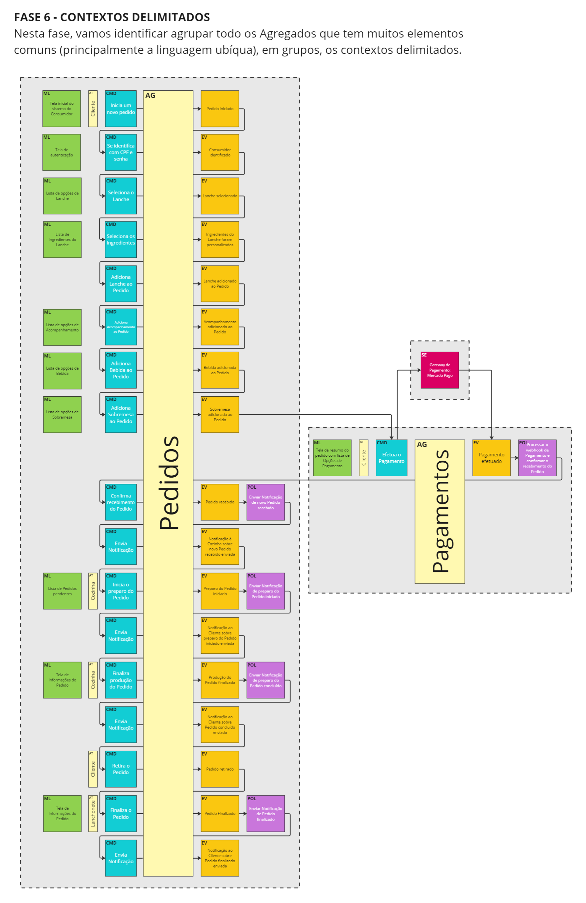

# DDD - Domain Driven Design

## Storytelling
We built a storytelling diagram using [egon.io](https://egon.io) and this diagrams can be accessed in `./docs/storytelling` folder or in following images:

### 01 - Create and Pay an Order workflow:

### 02 - Cook and Deliver an Order workflow:

## System Domains

## Event Storming

### Step 1

### Step 2

### Step 3

### Step 4

### Step 5

### Step 6

